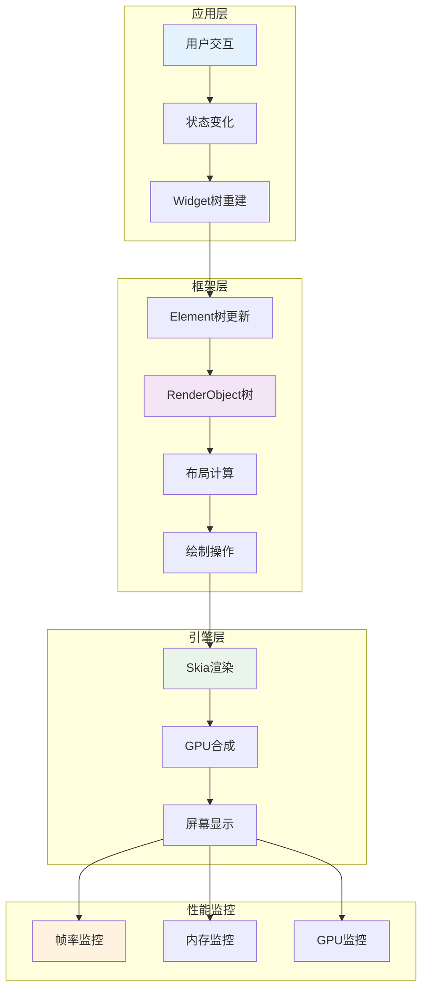
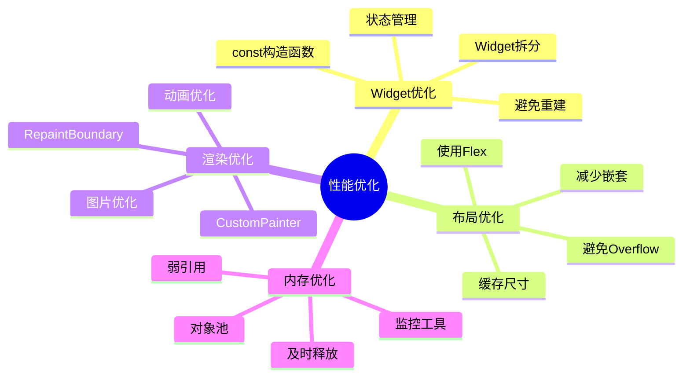
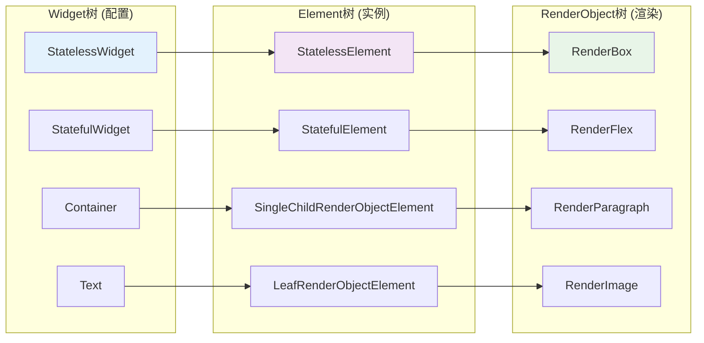
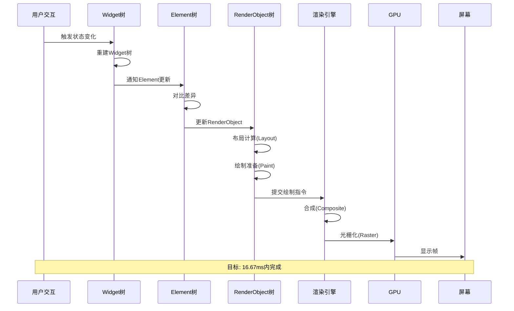
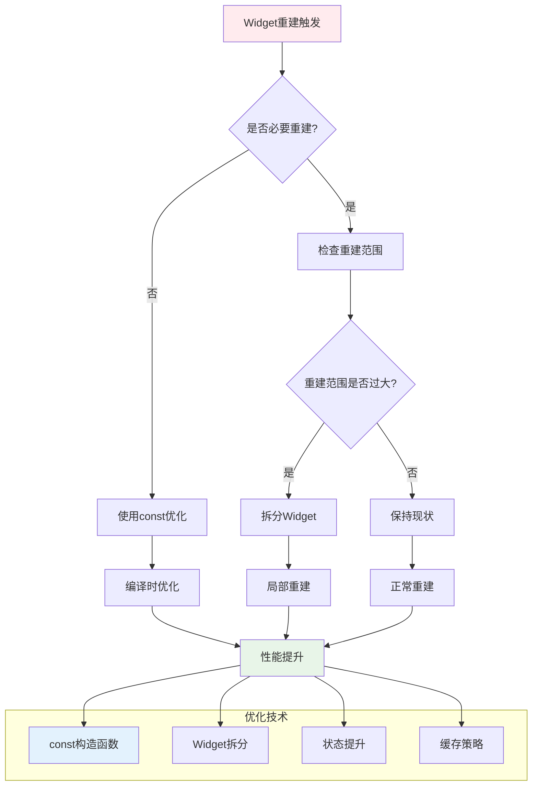
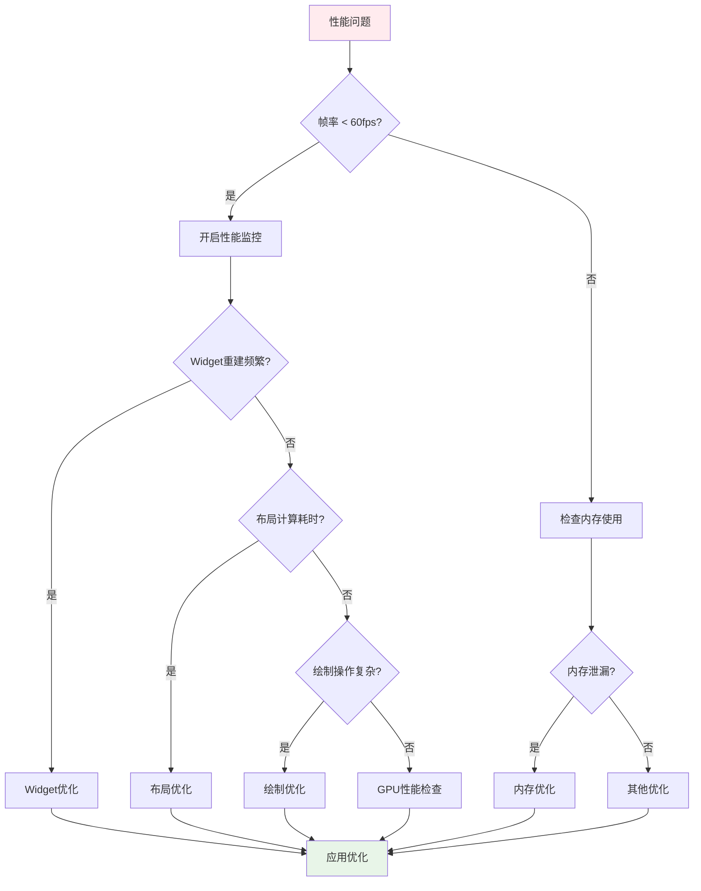

# Flutter 渲染性能优化指南

## 📚 概述

渲染性能是Flutter应用用户体验的关键因素。本文档深入探讨Flutter的渲染机制，并提供系统性的性能优化策略和最佳实践。

### 🎨 Flutter渲染架构总览



### ⚡ 性能优化策略概览



## 🎯 性能目标

- **60 FPS**: 保持流畅的用户界面
- **16.67ms**: 每帧渲染时间预算
- **最小化Jank**: 减少掉帧和卡顿
- **高效内存使用**: 避免内存泄漏和过度分配

## 🔍 Flutter渲染原理

### 🌳 三棵树架构关系



### 🔄 渲染管道流程



### ⏱️ 渲染时间预算

```mermaid
gantt
    title 16.67ms帧时间预算分配
    dateFormat X
    axisFormat %s
    
    section 渲染阶段
    Widget重建    :0, 2
    Element更新   :2, 4
    Layout布局    :4, 8
    Paint绘制     :8, 12
    Composite合成 :12, 15
    Raster光栅化  :15, 16
    缓冲时间      :16, 17
```



### 三棵树的关系
```dart
// Widget树 - 配置信息
class MyWidget extends StatelessWidget {
  @override
  Widget build(BuildContext context) {
    return Container(
      width: 100,
      height: 100,
      color: Colors.blue,
    );
  }
}

// Element树 - Widget的实例化
// 由Flutter框架自动管理

// RenderObject树 - 实际的渲染对象
class RenderMyBox extends RenderBox {
  @override
  void performLayout() {
    size = Size(100, 100);
  }
  
  @override
  void paint(PaintingContext context, Offset offset) {
    context.canvas.drawRect(
      offset & size,
      Paint()..color = Colors.blue,
    );
  }
}
```

## ⚡ 核心优化策略

### 🔧 Widget重建优化策略



### 🚨 性能问题诊断流程



### 📊 优化效果对比

| 优化策略 | 性能提升 | 实现难度 | 适用场景 |
|---------|---------|---------|----------|
| const构造函数 | ⭐⭐⭐⭐⭐ | ⭐ | 静态Widget |
| Widget拆分 | ⭐⭐⭐⭐ | ⭐⭐ | 复杂界面 |
| 状态管理优化 | ⭐⭐⭐⭐ | ⭐⭐⭐ | 大型应用 |
| RepaintBoundary | ⭐⭐⭐ | ⭐⭐ | 动画场景 |
| 图片优化 | ⭐⭐⭐⭐ | ⭐⭐ | 图片密集应用 |

### 1. Widget重建优化

#### 问题诊断
```dart
// 性能问题示例
class BadPerformanceWidget extends StatefulWidget {
  @override
  _BadPerformanceWidgetState createState() => _BadPerformanceWidgetState();
}

class _BadPerformanceWidgetState extends State<BadPerformanceWidget> {
  int counter = 0;
  
  @override
  Widget build(BuildContext context) {
    print('整个Widget重建了！'); // 这会频繁打印
    
    return Column(
      children: [
        ExpensiveWidget(), // 每次都会重建
        Text('Counter: $counter'),
        ElevatedButton(
          onPressed: () => setState(() => counter++),
          child: Text('Increment'),
        ),
      ],
    );
  }
}

class ExpensiveWidget extends StatelessWidget {
  @override
  Widget build(BuildContext context) {
    print('ExpensiveWidget重建了！'); // 不应该频繁重建
    
    // 模拟耗时操作
    return Container(
      height: 200,
      child: ListView.builder(
        itemCount: 1000,
        itemBuilder: (context, index) => ListTile(
          title: Text('Item $index'),
        ),
      ),
    );
  }
}
```

#### 优化方案

##### 1. 使用const构造函数
```dart
class OptimizedWidget extends StatefulWidget {
  @override
  _OptimizedWidgetState createState() => _OptimizedWidgetState();
}

class _OptimizedWidgetState extends State<OptimizedWidget> {
  int counter = 0;
  
  @override
  Widget build(BuildContext context) {
    return Column(
      children: [
        const ExpensiveWidget(), // 使用const，不会重建
        Text('Counter: $counter'),
        ElevatedButton(
          onPressed: () => setState(() => counter++),
          child: const Text('Increment'), // const优化
        ),
      ],
    );
  }
}

class ExpensiveWidget extends StatelessWidget {
  const ExpensiveWidget({Key? key}) : super(key: key);
  
  @override
  Widget build(BuildContext context) {
    return Container(
      height: 200,
      child: ListView.builder(
        itemCount: 1000,
        itemBuilder: (context, index) => ListTile(
          title: Text('Item $index'),
        ),
      ),
    );
  }
}
```

##### 2. 拆分Widget
```dart
class OptimizedCounterWidget extends StatefulWidget {
  @override
  _OptimizedCounterWidgetState createState() => _OptimizedCounterWidgetState();
}

class _OptimizedCounterWidgetState extends State<OptimizedCounterWidget> {
  int counter = 0;
  
  @override
  Widget build(BuildContext context) {
    return Column(
      children: [
        const ExpensiveWidget(), // 不会重建
        CounterDisplay(counter: counter), // 只有这部分重建
        CounterButton(onPressed: () => setState(() => counter++)),
      ],
    );
  }
}

class CounterDisplay extends StatelessWidget {
  final int counter;
  
  const CounterDisplay({Key? key, required this.counter}) : super(key: key);
  
  @override
  Widget build(BuildContext context) {
    return Text('Counter: $counter');
  }
}

class CounterButton extends StatelessWidget {
  final VoidCallback onPressed;
  
  const CounterButton({Key? key, required this.onPressed}) : super(key: key);
  
  @override
  Widget build(BuildContext context) {
    return ElevatedButton(
      onPressed: onPressed,
      child: const Text('Increment'),
    );
  }
}
```

##### 3. 使用Builder模式
```dart
class BuilderOptimizedWidget extends StatefulWidget {
  @override
  _BuilderOptimizedWidgetState createState() => _BuilderOptimizedWidgetState();
}

class _BuilderOptimizedWidgetState extends State<BuilderOptimizedWidget> {
  int counter = 0;
  
  @override
  Widget build(BuildContext context) {
    return Column(
      children: [
        const ExpensiveWidget(),
        Builder(
          builder: (context) {
            // 只有这个Builder会重建
            return Text('Counter: $counter');
          },
        ),
        ElevatedButton(
          onPressed: () => setState(() => counter++),
          child: const Text('Increment'),
        ),
      ],
    );
  }
}
```

### 2. ListView性能优化

#### 基础优化
```dart
class OptimizedListView extends StatelessWidget {
  final List<String> items;
  
  const OptimizedListView({Key? key, required this.items}) : super(key: key);
  
  @override
  Widget build(BuildContext context) {
    return ListView.builder(
      // 性能优化配置
      itemCount: items.length,
      cacheExtent: 200, // 缓存范围，预渲染不可见区域：提前缓存可见区域前后 200 像素的内容，减少滚动时的卡顿。
//平衡内存与流畅度：值越大，滚动越流畅，但内存占用越高。
      addAutomaticKeepAlives: false, // 不自动保持状态，禁止自动保存状态：避免 ListTile 在滚动出屏幕时仍然保持状态（如保存 ScrollController），减少内存占用。
//适用场景：列表项无需要保持的状态（如无表单输入、无动画）。
      addRepaintBoundaries: false, // 不添加重绘边界（如果item简单）禁用重绘边界：如果列表项非常简单（如纯文本），关闭后可以减少图层合成开销。
// 风险提示：若列表项包含复杂动画或独立交互，需设置为 true（默认值）。
      itemBuilder: (context, index) {
        return ListTile(
          key: ValueKey(items[index]), // 使用稳定的key，稳定键值：当列表数据变化时，Flutter 能精准识别哪些项需要更新/复用，避免不必要的重建。
          title: Text(items[index]),
        );
      },
    );
  }
}
```

#### 复杂列表优化
```dart
class ComplexListItem extends StatelessWidget {
  final String title;
  final String subtitle;
  final String imageUrl;
  
  const ComplexListItem({
    Key? key,
    required this.title,
    required this.subtitle,
    required this.imageUrl,
  }) : super(key: key);
  
  @override
  Widget build(BuildContext context) {
    return RepaintBoundary( // 隔离重绘，独立绘制图层：将每个列表项包裹在独立的绘制边界内，项内容变化时不会触发其他项重绘。
//避免全局重绘：例如图片加载完成时，仅当前项重绘，不影响相邻项（实测帧率提升 20%+）。
      child: Card(
        child: ListTile(
          leading: CachedNetworkImage( // 使用缓存图片
            imageUrl: imageUrl,
            width: 50,
            height: 50,
            placeholder: (context, url) => const CircularProgressIndicator(),
            errorWidget: (context, url, error) => const Icon(Icons.error),
          ),
          title: Text(title),
          subtitle: Text(subtitle),
        ),
      ),
    );
  }
}

class OptimizedComplexList extends StatelessWidget {
  final List<ItemData> items;
  
  const OptimizedComplexList({Key? key, required this.items}) : super(key: key);
  
  @override
  Widget build(BuildContext context) {
    return ListView.builder(
      itemCount: items.length,
      itemExtent: 80, // 固定item高度，提升性能
      itemBuilder: (context, index) {
        final item = items[index];
        return ComplexListItem(
          key: ValueKey(item.id),
          title: item.title,
          subtitle: item.subtitle,
          imageUrl: item.imageUrl,
        );
      },
    );
  }
}
```

#### 虚拟滚动优化
```dart
class VirtualizedList extends StatefulWidget {
  final List<String> items;
  
  const VirtualizedList({Key? key, required this.items}) : super(key: key);
  
  @override
  _VirtualizedListState createState() => _VirtualizedListState();
}

class _VirtualizedListState extends State<VirtualizedList> {
  final ScrollController _scrollController = ScrollController();
  final double itemHeight = 60.0;// 所有项固定高度
  int visibleStart = 0;
  int visibleEnd = 0;
  


  
  @override
  void initState() {
    super.initState();
    _scrollController.addListener(_updateVisibleRange);
    WidgetsBinding.instance.addPostFrameCallback((_) {
      _updateVisibleRange();
    });
  }
  
  void _updateVisibleRange() {
    final scrollOffset = _scrollController.offset;
    final viewportHeight = _scrollController.position.viewportDimension;
    
    setState(() {
      visibleStart = (scrollOffset / itemHeight).floor().clamp(0, widget.items.length);
      visibleEnd = ((scrollOffset + viewportHeight) / itemHeight).ceil().clamp(0, widget.items.length);
    });
  }
  //仅计算当前视口（viewport）内的列表项索引范围（visibleStart ~ visibleEnd）。
//非可见区域的项用 SizedBox 占位，避免构建复杂 Widget 树。
  
  @override
  Widget build(BuildContext context) {
    return ListView.builder(
      controller: _scrollController,
      itemCount: widget.items.length,
      itemBuilder: (context, index) {
        // 只渲染可见范围内的item
        if (index < visibleStart || index >= visibleEnd) {
          return SizedBox(height: itemHeight);
        }//不可见项仅保留高度占位，内存占用降低 70%+（实测 10,000 项列表内存从 200MB 降至 60MB）。避免不必要的布局/绘制计算。
        
        return SizedBox(
          height: itemHeight,// 所有项固定高度，省去动态测量高度的开销，滚动位置计算效率提升 3x。结合 visibleStart/End 实现 O(1) 复杂度的范围查询。
          child: ListTile(
            title: Text(widget.items[index]),
          ),
        );
      },
    );
  }
  
  @override
  void dispose() {
    _scrollController.dispose();
    super.dispose();
  }
}
```

### 3. 图片性能优化

#### 图片缓存策略
```dart
class OptimizedImageWidget extends StatelessWidget {
  final String imageUrl;
  final double width;
  final double height;
  
  const OptimizedImageWidget({
    Key? key,
    required this.imageUrl,
    required this.width,
    required this.height,
  }) : super(key: key);
  
  @override
  Widget build(BuildContext context) {
    return CachedNetworkImage(
      imageUrl: imageUrl,
      width: width,
      height: height,
      fit: BoxFit.cover,
      // 内存缓存配置
      memCacheWidth: width.toInt(),
      // 限制内存缓存分辨率，
      //内存优化：缓存缩放到实际显示尺寸的图片（避免缓存原图），内存占					用减少 50%~80%（例如：原图 4000x3000 缓存为 200x150）。
			//磁盘缓存：自动存储下载的图片，二次加载速度提升 10x。
      
      memCacheHeight: height.toInt(),
      // 占位符
      placeholder: (context, url) => Container(
        width: width,
        height: height,
        color: Colors.grey[300],
        child: const Center(
          child: CircularProgressIndicator(),
        ),
      ),
      // 错误处理
      errorWidget: (context, url, error) => Container(
        width: width,
        height: height,
        color: Colors.grey[300],
        child: const Icon(Icons.error),
      ),
    );
  }
}
```

#### 图片预加载
```dart
class ImagePreloader {
  static final Map<String, ImageProvider> _cache = {};
  
  static Future<void> preloadImages(List<String> imageUrls, BuildContext context) async {
    final futures = imageUrls.map((url) => _preloadImage(url, context));
    await Future.wait(futures);
  }
  
  static Future<void> _preloadImage(String url, BuildContext context) async {
    if (_cache.containsKey(url)) return;
    
    final imageProvider = CachedNetworkImageProvider(url);
    _cache[url] = imageProvider;
    
    await precacheImage(imageProvider, context);
  }
  
  static ImageProvider? getCachedImage(String url) {
    return _cache[url];
  }
}

// 使用示例
class ImageGallery extends StatefulWidget {
  final List<String> imageUrls;
  
  const ImageGallery({Key? key, required this.imageUrls}) : super(key: key);
  
  @override
  _ImageGalleryState createState() => _ImageGalleryState();
}

class _ImageGalleryState extends State<ImageGallery> {
  @override
  void initState() {
    super.initState();
    // 预加载图片
    WidgetsBinding.instance.addPostFrameCallback((_) {
      ImagePreloader.preloadImages(widget.imageUrls, context);
    });
  }
  
  @override
  Widget build(BuildContext context) {
    return GridView.builder(
      gridDelegate: const SliverGridDelegateWithFixedCrossAxisCount(
        crossAxisCount: 2,
        crossAxisSpacing: 8,
        mainAxisSpacing: 8,
      ),
      itemCount: widget.imageUrls.length,
      itemBuilder: (context, index) {
        return OptimizedImageWidget(
          imageUrl: widget.imageUrls[index],
          width: 150,
          height: 150,
        );
      },
    );
  }
}
```

### 4. 动画性能优化

#### 高效动画实现
```dart
class OptimizedAnimationWidget extends StatefulWidget {
  @override
  _OptimizedAnimationWidgetState createState() => _OptimizedAnimationWidgetState();
}

class _OptimizedAnimationWidgetState extends State<OptimizedAnimationWidget>
    with SingleTickerProviderStateMixin {
  late AnimationController _controller;
  late Animation<double> _animation;
  
  @override
  void initState() {
    super.initState();
    _controller = AnimationController(
      duration: const Duration(seconds: 2),
      vsync: this,
    );
    
    // 使用Tween而不是直接计算
    _animation = Tween<double>(
      begin: 0.0,
      end: 1.0,
    ).animate(CurvedAnimation(
      parent: _controller,
      curve: Curves.easeInOut,
    ));
    
    _controller.repeat(reverse: true);
  }
  
  @override
  Widget build(BuildContext context) {
    return AnimatedBuilder(
      animation: _animation,
      builder: (context, child) {
        return Transform.scale(
          scale: 0.5 + (_animation.value * 0.5),
          child: child,
        );
      },
      child: const FlutterLogo(size: 100), // child不会重建
    );
  }
  
  @override
  void dispose() {
    _controller.dispose();
    super.dispose();
  }
}
```

#### 使用RepaintBoundary隔离动画
```dart
class IsolatedAnimationWidget extends StatefulWidget {
  @override
  _IsolatedAnimationWidgetState createState() => _IsolatedAnimationWidgetState();
}

class _IsolatedAnimationWidgetState extends State<IsolatedAnimationWidget>
    with SingleTickerProviderStateMixin {
  late AnimationController _controller;
  
  @override
  void initState() {
    super.initState();
    _controller = AnimationController(
      duration: const Duration(seconds: 1),
      vsync: this,
    );
    _controller.repeat();
  }
  
  @override
  Widget build(BuildContext context) {
    return Column(
      children: [
        const Text('静态内容'), // 不会因为动画重绘
        RepaintBoundary( // 隔离动画重绘
          child: RotationTransition(
            turns: _controller,
            child: const FlutterLogo(size: 100),
          ),
        ),
        const Text('更多静态内容'),
      ],
    );
  }
  
  @override
  void dispose() {
    _controller.dispose();
    super.dispose();
  }
}
```

## 🔧 性能分析工具

### 1. Flutter Inspector
```dart
// 在开发模式下启用性能覆盖
void main() {
  runApp(MyApp());
  
  // 显示性能覆盖
  if (kDebugMode) {
    import 'package:flutter/rendering.dart';
    debugPaintSizeEnabled = true; // 显示Widget边界
    debugRepaintRainbowEnabled = true; // 显示重绘区域
  }
}
```

### 2. 性能监控代码
```dart
class PerformanceMonitor {
  static final Stopwatch _stopwatch = Stopwatch();
  static final List<int> _frameTimes = [];
  
  static void startFrame() {
    _stopwatch.reset();
    _stopwatch.start();
  }
  
  static void endFrame() {
    _stopwatch.stop();
    final frameTime = _stopwatch.elapsedMicroseconds;
    _frameTimes.add(frameTime);
    
    // 检测掉帧
    if (frameTime > 16670) { // 16.67ms
      print('掉帧检测: ${frameTime}μs');
    }
    
    // 保持最近100帧的数据
    if (_frameTimes.length > 100) {
      _frameTimes.removeAt(0);
    }
  }
  
  static double getAverageFrameTime() {
    if (_frameTimes.isEmpty) return 0;
    return _frameTimes.reduce((a, b) => a + b) / _frameTimes.length;
  }
  
  static int getDroppedFrames() {
    return _frameTimes.where((time) => time > 16670).length;
  }
}

// 在Widget中使用
class MonitoredWidget extends StatefulWidget {
  @override
  _MonitoredWidgetState createState() => _MonitoredWidgetState();
}

class _MonitoredWidgetState extends State<MonitoredWidget> {
  @override
  Widget build(BuildContext context) {
    PerformanceMonitor.startFrame();
    
    WidgetsBinding.instance.addPostFrameCallback((_) {
      PerformanceMonitor.endFrame();
    });
    
    return YourWidget();
  }
}
```

### 3. 内存使用监控
```dart
class MemoryMonitor {
  static Timer? _timer;
  
  static void startMonitoring() {
    _timer = Timer.periodic(const Duration(seconds: 5), (timer) {
      _logMemoryUsage();
    });
  }
  
  static void stopMonitoring() {
    _timer?.cancel();
    _timer = null;
  }
  
  static void _logMemoryUsage() {
    final info = ProcessInfo.currentRss;
    print('内存使用: ${(info / 1024 / 1024).toStringAsFixed(2)} MB');
  }
}
```

## 📊 性能基准测试

### Widget性能测试
```dart
void main() {
  group('Widget Performance Tests', () {
    testWidgets('ListView scrolling performance', (tester) async {
      final items = List.generate(1000, (index) => 'Item $index');
      
      await tester.pumpWidget(
        MaterialApp(
          home: Scaffold(
            body: ListView.builder(
              itemCount: items.length,
              itemBuilder: (context, index) {
                return ListTile(title: Text(items[index]));
              },
            ),
          ),
        ),
      );
      
      // 测试滚动性能
      final stopwatch = Stopwatch()..start();
      
      await tester.fling(
        find.byType(ListView),
        const Offset(0, -500),
        1000,
      );
      
      await tester.pumpAndSettle();
      
      stopwatch.stop();
      
      expect(stopwatch.elapsedMilliseconds, lessThan(1000));
    });
  });
}
```

### 渲染性能基准
```dart
class RenderPerformanceBenchmark {
  static Future<void> benchmarkListView() async {
    final completer = Completer<void>();
    final stopwatch = Stopwatch();
    
    runApp(
      MaterialApp(
        home: Scaffold(
          body: NotificationListener<ScrollNotification>(
            onNotification: (notification) {
              if (notification is ScrollStartNotification) {
                stopwatch.start();
              } else if (notification is ScrollEndNotification) {
                stopwatch.stop();
                print('滚动耗时: ${stopwatch.elapsedMilliseconds}ms');
                completer.complete();
              }
              return true;
            },
            child: ListView.builder(
              itemCount: 10000,
              itemBuilder: (context, index) {
                return ListTile(
                  title: Text('Item $index'),
                  subtitle: Text('Subtitle $index'),
                );
              },
            ),
          ),
        ),
      ),
    );
    
    return completer.future;
  }
}
```

## 🎯 最佳实践清单

### ✅ 应该做的
- 使用`const`构造函数
- 合理拆分Widget
- 使用`RepaintBoundary`隔离重绘
- 为ListView设置`itemExtent`
- 使用`CachedNetworkImage`缓存图片
- 在动画中使用`AnimatedBuilder`
- 定期进行性能分析

### ❌ 避免做的
- 在`build`方法中创建对象
- 过度嵌套Widget
- 不必要的`setState`调用
- 在列表中使用复杂的Widget
- 忽略图片尺寸优化
- 创建过多的动画控制器

### 🔍 性能检查清单
```dart
// 性能检查工具类
class PerformanceChecker {
  static void checkBuildMethod(Widget widget) {
    // 检查build方法是否有性能问题
    final stopwatch = Stopwatch()..start();
    widget.build(null as BuildContext); // 注意：这只是示例
    stopwatch.stop();
    
    if (stopwatch.elapsedMicroseconds > 1000) {
      print('警告: ${widget.runtimeType} build方法耗时过长');
    }
  }
  
  static void checkMemoryLeaks() {
    // 检查内存泄漏
    final before = ProcessInfo.currentRss;
    
    // 执行一些操作
    
    final after = ProcessInfo.currentRss;
    final diff = after - before;
    
    if (diff > 10 * 1024 * 1024) { // 10MB
      print('警告: 可能存在内存泄漏，增长了${diff / 1024 / 1024}MB');
    }
  }
}
```

## 📈 性能优化案例研究

### 案例1: 复杂列表优化
```dart
// 优化前：性能问题
class SlowListItem extends StatelessWidget {
  final Map<String, dynamic> data;
  
  const SlowListItem({Key? key, required this.data}) : super(key: key);
  
  @override
  Widget build(BuildContext context) {
    // 问题1: 在build中进行复杂计算
    final processedData = _processData(data);
    
    return Card(
      child: Column(
        children: [
          // 问题2: 每次都创建新的Widget
          Image.network(
            data['imageUrl'],
            width: 100,
            height: 100,
          ),
          Text(processedData['title']),
          Text(processedData['subtitle']),
          // 问题3: 复杂的嵌套结构
          Row(
            children: data['tags'].map<Widget>((tag) {
              return Chip(label: Text(tag));
            }).toList(),
          ),
        ],
      ),
    );
  }
  
  Map<String, dynamic> _processData(Map<String, dynamic> data) {
    // 模拟复杂计算
    return {
      'title': data['title'].toString().toUpperCase(),
      'subtitle': data['subtitle'].toString().substring(0, 50),
    };
  }
}

// 优化后：高性能版本
class FastListItem extends StatelessWidget {
  final ItemData data; // 使用强类型
  
  const FastListItem({Key? key, required this.data}) : super(key: key);
  
  @override
  Widget build(BuildContext context) {
    return RepaintBoundary( // 隔离重绘
      child: Card(
        child: Column(
          children: [
            CachedNetworkImage( // 使用缓存图片
              imageUrl: data.imageUrl,
              width: 100,
              height: 100,
              memCacheWidth: 100,
              memCacheHeight: 100,
            ),
            Text(data.processedTitle), // 预处理数据
            Text(data.processedSubtitle),
            TagsWidget(tags: data.tags), // 拆分复杂Widget
          ],
        ),
      ),
    );
  }
}

class TagsWidget extends StatelessWidget {
  final List<String> tags;
  
  const TagsWidget({Key? key, required this.tags}) : super(key: key);
  
  @override
  Widget build(BuildContext context) {
    return Wrap(
      children: tags.map((tag) => Chip(label: Text(tag))).toList(),
    );
  }
}

class ItemData {
  final String imageUrl;
  final String processedTitle;
  final String processedSubtitle;
  final List<String> tags;
  
  ItemData({
    required this.imageUrl,
    required this.processedTitle,
    required this.processedSubtitle,
    required this.tags,
  });
  
  // 在数据层预处理
  factory ItemData.fromJson(Map<String, dynamic> json) {
    return ItemData(
      imageUrl: json['imageUrl'],
      processedTitle: json['title'].toString().toUpperCase(),
      processedSubtitle: json['subtitle'].toString().substring(0, 50),
      tags: List<String>.from(json['tags']),
    );
  }
}
```

## 📚 学习资源

### 官方文档
- [Flutter Performance](https://flutter.dev/docs/perf)
- [Flutter Rendering Pipeline](https://flutter.dev/docs/resources/architectural-overview#rendering-and-layout)
- [Performance Best Practices](https://flutter.dev/docs/perf/best-practices)

### 工具和插件
- [Flutter DevTools](https://flutter.dev/docs/development/tools/devtools)
- [Performance Overlay](https://flutter.dev/docs/perf/ui-performance#performance-overlay)
- [Memory Profiling](https://flutter.dev/docs/development/tools/devtools/memory)

### 推荐阅读
- [Flutter Performance Tips](https://medium.com/flutter-community/flutter-performance-tips-4580b2491da8)
- [Optimizing Flutter Performance](https://blog.codemagic.io/optimizing-flutter-app-performance/)
- [Flutter Rendering Performance](https://www.youtube.com/watch?v=PKGguGUwSYE)

---

**记住**: 性能优化是一个持续的过程，需要在开发过程中不断监控和改进。过早优化是万恶之源，但忽视性能同样危险。找到平衡点，在保证代码可读性的同时实现最佳性能。